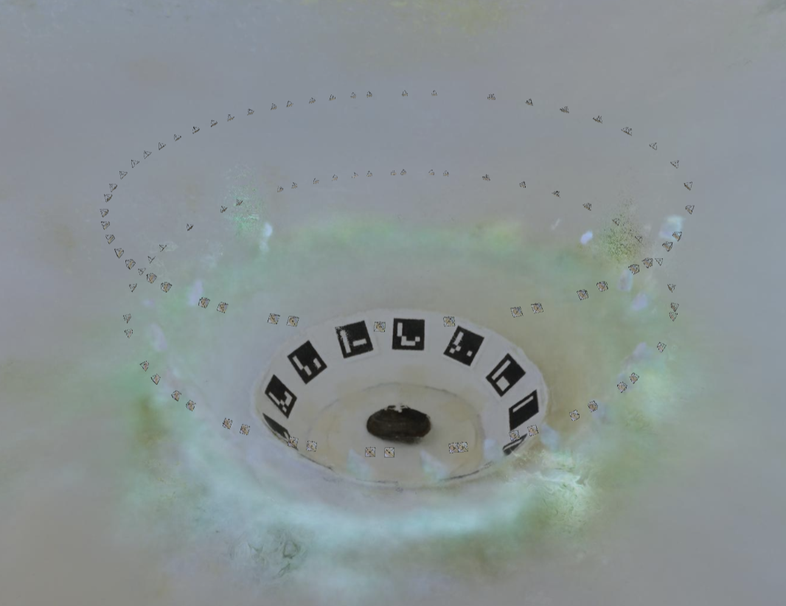
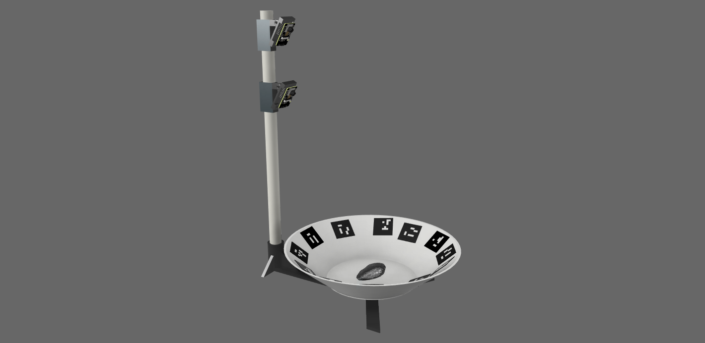

# Mussel 3D Imager

We leverage advanced 3D reconstruction techniques to enhance the accuracy of AI-based mussel analysis. Specifically, we utilize Neural Radiance Fields (NeRF), a cutting-edge 3D reconstruction tool, to generate detailed 3D models of mussel valve configurations and behavioral patterns. NeRF reconstructs 3D scenes and objects from a sparse set of 2D images.

To facilitate image capture, we developed a custom data collection system capable of imaging mussels from multiple angles. This system includes a turntable constructed from foam board, marked along the edges for reference, with a central mounting area for the mussels. A servo motor, controlled by an ESP32 microcontroller, rotates the turntable in small increments, while an ESP32 camera captures images at each step. The captured images, along with rotation degree data and timestamps, are stored on a Secure Digital (SD) card.

Additionally, several key components, such as the camera holder and turntable base, are 3D-printed. The collected images are then used to train a NeRF model using the Python-based Nerfstudio framework, and the generated 3D models can be visualized through the Nerfstudio API.


## Assembly Instructions:

You will need: 

1. A 1/2" PVC pipe
2. 3/16" thick foam baord to construct base plate 
3. Printed 3D parts, located in the 3D Parts folder

Construct the base plate by cutting a 1ft diameter circle out of the foam board. Create the rim for the plate by cutting out a 3.5in by 3ft rectangle. Score it with a blade to allow it to form a ring as seen in the image below. Attach the Dis+Base+Bottom part to the bottom of the plate and the Disc+Base+Top file on top of the plate, and secure them together with screws. Glue the arm of the Servo motor to the center of the Dis+Base+Bottom part. place the servo into the slot in the Base+Part+1 part. 

The Base+Part+1 and Base+Part+2 should be secured to a surface using tape or clamps when running, as they will topple over if not secured. 

ESP32 Mount Instructions:

Super glue the ESP32+-+Joint+Attachment to the back of the ESP32+-+Mount. The PVC+Suport+with+Connector should fit snugly into the gap of the ESP32+-+Joint+Attachment. Use a screw and a nut to keep it in place. The ESP32 Mount should be able to rotate tightly. Attach it to the PVC pipe, using zip ties to keep it secure. 

Read the README_code.txt file for instructions on programming.

## 3D reconstruction instructions using NeRFStudio:
This section provides instructions for performing 3D reconstruction using Nerfstudio.
### Installation
To set up the environment, follow the installation instructions from the official Nerfstudio documentation: https://docs.nerf.studio/quickstart/installation.html
### Data Processing
Once installed, process your image dataset by running the following command:
```bash
ns-process-data images --data {DATA_PATH} --output-dir {PROCESSED_DATA_DIR}
```
Replace {DATA_PATH} with the path to your dataset and {PROCESSED_DATA_DIR} with the desired output directory for processed data.
### Training
Train the Nerfacto model using the processed data:
```bash
ns-train nerfacto --data {PROCESSED_DATA_DIR}
```
### Evaluation
To evaluate the trained model, use the following command:
```bash
ns-eval --load-config={PATH_TO_CONFIG} --output-path=output.json
```
Replace {PATH_TO_CONFIG} with the path to your configuration file.
### Results
The evaluation results will be saved in output.json.

For more details, refer to the Nerfstudio documentation.
## Mussel 3D reconstruction Output:


## ESP32 based imaging system:


## Mussel ESP32 3D Reconstruction
Video - https://www.youtube.com/watch?v=Asff8yX_VgY

## Citation

If you use this work in your research, please cite:

```bibtex
@inproceedings{sanap2025ai,
  author    = {Mayur Sanap and Arman Badalamenti and Devadharshini Ayyappan and Sanjana Banerjee and Diana Milena Urieta and Caren Cooper and Michael Daniele and James Reynolds and Jay F. Levine and Alper Bozkurt and Edgar Lobaton},
  title     = {AI-Driven Mussel Behavior Monitoring Using an Accessible 3D Imaging System},
  booktitle = {Proceedings of the 2025 ASEE Annual Conference \& Exposition},
  year      = {2025},
  address   = {Montreal, QC},
  month     = {June 22--25},
  organization = {ASEE}
}
```

## Contact Us

If you have any questions or suggestions, feel free to reach out:

- Mayur Sanap - msanap@ncsu.edu
- Dr. Edgar Lobaton - edgar.lobaton@ncsu.edu  
